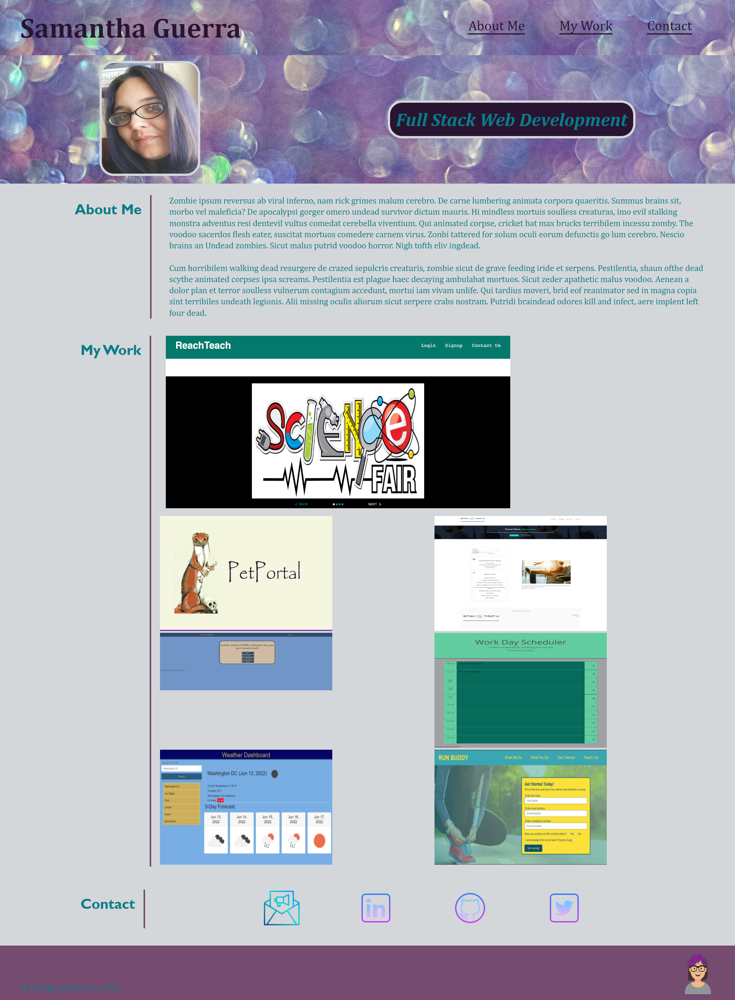

# Portfolio of Coding Projects

## Table of Contents
1. [Project Description](#project-description)
2. [Usage](#usage)
3. [Built With](#built-with)
4. [Author](#author)
5. [Contributions](#contributions)
6. [Development](#development)

## Project Description
The goal of this project is to provide a deployed portfolio of work samples so that prospective employers have a review them and determine if I'd be a good fit for open positions.

## Usage
This project is deployed at a live URL 
[CLick for Deployed Portfolio](https://sam-antics.github.io/portfolio/)
### Site Screenshot

## Built With
* HTML
* CSS

## Author
**Samantha Guerra**

- [GitHub Profile](https://github.com/Sam-Antics)
- [Email](sameguerra@sbcglobal.net)

## Contributions
Purple Glitter - photo by [Nixx Studio](https://unsplash.com/@nechamalock?utm_source=unsplash&utm_medium=referral&utm_content=creditCopyText)
[Twitter Squared](https://icons8.com/icon/MP7jET0S1bw5/twitter-squared) icon by [Icons8](https://icons8.com)  
[Email](https://icons8.com/icon/eWFdbcsig4Eq/email) icon by [Icons8](https://icons8.com)  
[GitHub](https://icons8.com/icon/52539/github) icon by [Icons8](https://icons8.com)  
[LinkedIn](https://icons8.com/icon/44019/linkedin) icon by [Icons8](https://icons8.com)

## Development
This was my first project portfolio, whic was built in the second week of the 24-week MERN stack coding bootcamp, which I completed in October of 2022. This project was periodically updated to include projects as I completed them.